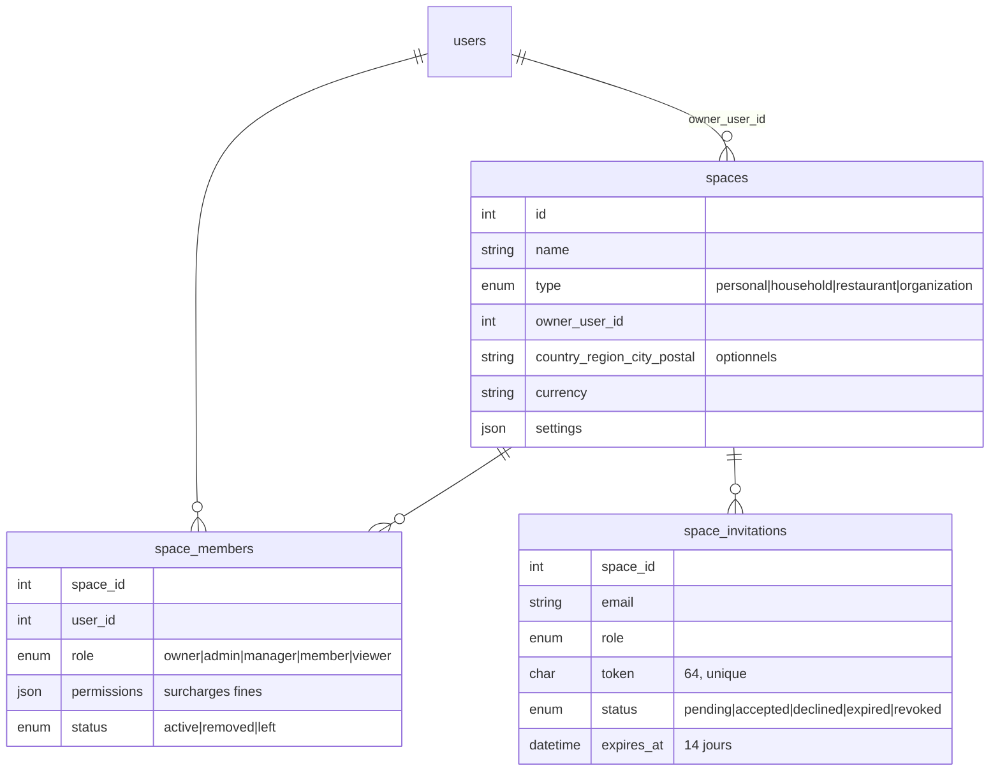

# Architecture des espaces

Phase 1 livrée le 2026-09-30. Contexte et décisions :
`docs/audit-espaces-epilist.md`.

## Modèle



- **Espace personnel matérialisé** : une ligne `spaces(type='personal')`
  par utilisateur — backfill SQL + création paresseuse
  (`Space::personalFor`). Unique, non supprimable, non partageable,
  nom affiché traduit côté client (le type fait foi).
- Un utilisateur = owner de son personnel + membre de 0..n autres
  espaces.

## Résolution de l'espace par requête

```
App ── X-Space-Id: 42 ──▶ API
                           │ SpaceAccessService::resolveSpace()
                           │  · pas d'en-tête → espace personnel
                           │  · en-tête → membre ACTIF vérifié en BASE
                           │    (sinon 403, identique que l'espace
                           │     existe ou non : pas d'énumération)
                           ▼
                        contrôleurs
```

Trois primitives, un seul point de contrôle
(`api/src/Services/SpaceAccessService.php`) :

| Fonction | Garantie |
|---|---|
| `resolveSpace(request, userId)` | espace ciblé, appartenance vérifiée |
| `assertMember(spaceId, userId)` | membre actif ou 403 |
| `assertPermission(spaceId, userId, perm)` | membre + permission ou 403 |

## Endpoints (Phase 1)

Tous sous JwtMiddleware :

```
GET    /spaces                          mes espaces (personnel garanti, en premier)
POST   /spaces                          créer (household|restaurant|organization)
GET    /spaces/{id}                     détail
PUT    /spaces/{id}                     nom (sauf personnel) + localisation
DELETE /spaces/{id}                     owner seulement, jamais le personnel
GET    /spaces/{id}/members
PUT    /spaces/{id}/members/{userId}    rôle / permissions fines
DELETE /spaces/{id}/members/{userId}    retirer (owner intouchable)
POST   /spaces/{id}/leave               jamais l'owner ni le personnel
POST   /spaces/{id}/invitations         inviter par email
GET    /spaces/{id}/invitations         en attente
DELETE /spaces/{id}/invitations/{invId} révoquer
GET    /space-invitations               mes invitations reçues (jeton inclus
                                        UNIQUEMENT ici, pour le destinataire)
POST   /space-invitations/{token}/accept   nominative : email du compte requis
POST   /space-invitations/{token}/decline
```

## Côté application

| Élément | Fichier |
|---|---|
| Modèles | `lib/models/space.dart` |
| Service + espace actif + en-tête | `lib/services/space_service.dart` (`SpaceService`, `ActiveSpaceStore` persistant/observable, `SpaceHeaderInterceptor`) |
| Sélecteur (drawer « Personnel ▼ ») | `lib/widgets/common/app_drawer.dart` + `space_selector_sheet.dart` |
| Création (type → nom → optionnel) | `lib/screens/create_space_screen.dart` |
| Membres / invitations / quitter | `lib/screens/space_members_screen.dart` |

L'espace actif est remis au personnel à la déconnexion
(`AuthService.clearUserData`).

## Ce que la Phase 1 ne change pas

Aucune table métier ne porte encore `space_id` : toutes les données
restent servies par `user_id`, l'en-tête est ignoré par les endpoints
existants. Le rattachement arrive en Phase 2, table par table
(stratégie : `docs/migration-espaces.md`).

## Tests

`php api/scripts/test_spaces_e2e.php` (API locale requise) — 31
vérifications : isolation inter-espaces, non-énumération, rôles,
surcharges de permission, cycle complet d'invitation (nominative,
jeton non réutilisable), protections du personnel et de l'owner.
