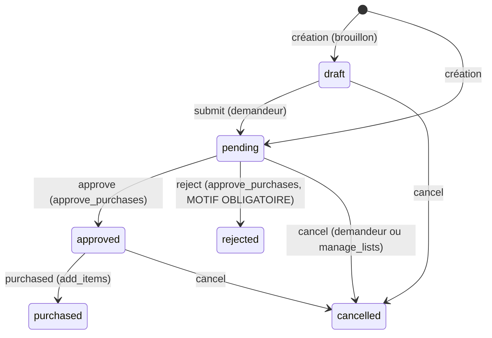

# Module restaurant (Phase 3)

Livré le 2026-09-30. Prérequis : Phases 1-2. Migration :
`api/migrations/add_spaces_phase3.sql` (idempotente).

## Demandes d'achat (§20)

Flux : employé → besoin → demande → validation → achat.

- Transitions validées par machine à états (`PurchaseRequest::TRANSITIONS`) ;
  toute autre = 422 `INVALID_TRANSITION`.
- Chaque changement historisé (`purchase_request_events` : qui, de, vers,
  commentaire, quand) et journalisé dans l'activité de l'espace.
- Demandeur, approbateur, date et motif de décision conservés (§20).
- Espace PARTAGÉ requis : le personnel renvoie une liste vide.

Endpoints : `GET/POST /purchase-requests`, `GET /purchase-requests/{id}`
(détail + historique), `POST .../{id}/submit|approve|reject|purchased|cancel`.

## Fournisseurs (§22)

`suppliers` par espace : nom, contact, téléphone, email, notes,
actif/inactif, soft delete. Lecture : tout membre. Écriture :
`manage_suppliers` (owner/admin/manager par défaut). La comparaison de
prix par fournisseur branche sur le moteur de prix en Phase 4 (les
fournisseurs sont référencés par `home_inventory.preferred_supplier_id`).

## Inventaire quantitatif (§21)

`home_inventory` gagne `min_quantity`, `reorder_quantity`,
`preferred_supplier_id`. L'API renvoie `below_min`
(`quantity <= min_quantity`). Rien n'est commandé automatiquement :
l'app PROPOSE (demande d'achat ou ajout à la liste), l'humain décide.

## Application

- Drawer : « Demandes d'achat » et « Fournisseurs » apparaissent quand
  l'espace ACTIF est un restaurant ou une organisation.
- Écran demandes : création (produit/quantité/unité/note), statuts
  colorés, approbation/refus (motif obligatoire) si owner/admin/manager,
  « marquer achetée », annulation par le demandeur. Le serveur reste
  seul juge des droits.
- Écran fournisseurs : CRUD léger + inactif.
- Activité : 3 nouveaux événements rendus traduits.
- 36 clés i18n fr/en (0 untranslated).

## Sécurité vérifiée (E2E 79/79)

Employé `member` : crée une demande mais ne peut PAS approuver (403) ;
refus sans motif → 422 ; approbateur tracé ; transitions invalides →
422 ; non-membre → 403 ; fournisseurs en écriture réservés à
`manage_suppliers` ; `below_min` calculé côté serveur.

## Reporté (assumé)

- Dashboard restaurant (§18) et section « stock critique » dédiée →
  dashboard adaptatif (§45), après la Phase 5.
- Approuvé → ajout automatique à une liste d'achat : volontairement
  manuel Phase 3 (l'app crée l'article puis marque `purchased`).
- Prix par fournisseur (§22 comparaison) → Phase 4.
- Édition des seuils min/réappro dans l'app → avec le dashboard.
